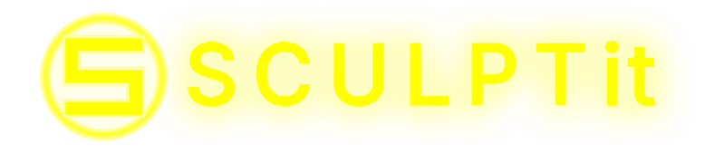
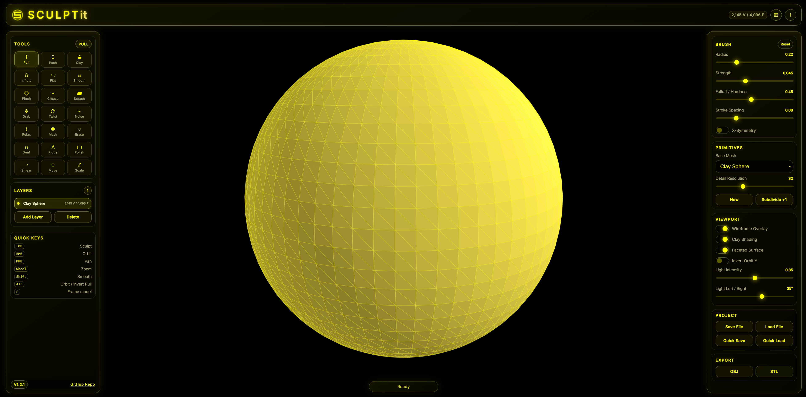
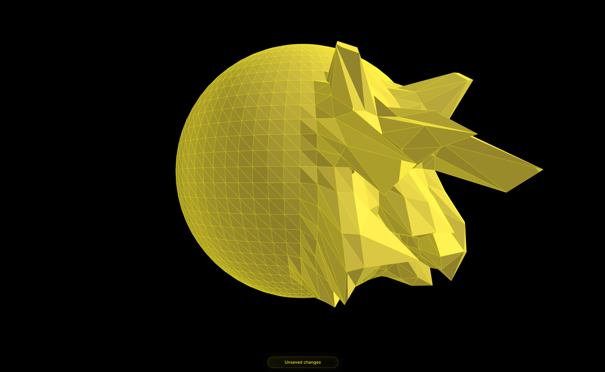
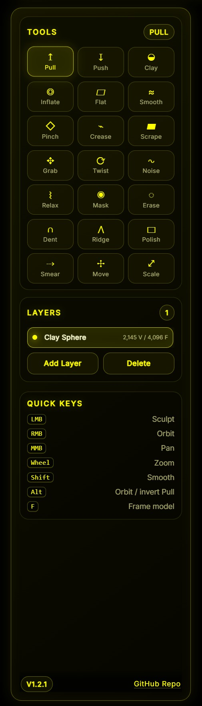
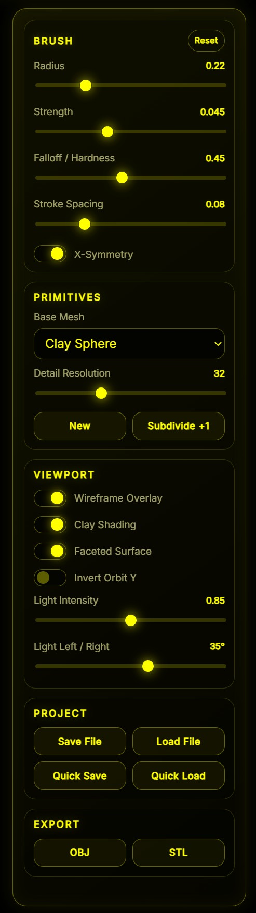

# SCULPTit Static Web Sculpting Editor

SCULPTit is a lightweight static 3D sculpting editor for fast local digital-clay modeling, primitive blocking and mesh export. It is designed for a quick browser-based workflow without Electron, Node.js installation or a heavy desktop runtime. The application runs from plain project files through a local static webserver and stores/exports data through browser download and upload APIs.


---

## Start

Use the included Windows starter:

```bat
start_SCULPTit.bat
```

Then open:

```text
http://127.0.0.1:8080/
```

A local webserver is required because browsers block some file loading features when opening `index.html` directly from disk. The starter uses Python's built-in static webserver if Python is installed. If Python is not available, the included fallback server can be used where supported.

---

## Previews






---

## Controls

| Action | Input |
|---|---|
| Sculpt active layer | Left mouse drag on the model |
| Temporarily smooth | Hold `Shift` while sculpting |
| Invert brush effect | Hold `Alt` while sculpting |
| Orbit camera | Right mouse drag |
| Pan camera | Middle mouse drag |
| Zoom / dolly | Mouse wheel |
| Select tool | Left tool panel |
| Change brush radius | Radius slider |
| Change brush strength | Strength slider |
| Toggle symmetry | X-Symmetry switch |
| Add primitive layer | Layers / Primitives controls |
| Reset scene | New button |

The same control summary can be shown inside the application through the **Controls** button in the top right app bar.

---

## Important Notes

- Use a modern Chromium, Edge or Firefox browser with WebGL support.
- The app is fully static and does not require Electron.
- The included Bootstrap files are a compact local compatibility layer for this project, not a full Bootstrap distribution.
- Editable project data can be saved as `.sculptit` JSON.
- Quick Save stores the current project in the browser's local storage.
- OBJ export and ASCII STL export are available.
- The in-app documentation is loaded from `assets/Documentation.md` and can be edited without changing the JavaScript.
- For best results, keep Wireframe Overlay enabled while sculpting. It makes the clay surface and mesh faces easier to read.
- Very high subdivision levels can affect browser performance depending on the device.

---

## Main Features

### Digital Clay Base Mesh

SCULPTit starts with a faceted digital-clay base object. The default primitive is a sphere-like clay mesh with visible surface faces and a wireframe overlay, making it easier to read the topology while sculpting. Additional primitives can be added or selected from the right panel.

### Primitive Blocking

The **Primitives** section provides standard base forms for fast blocking and modeling.

| Primitive | Purpose |
|---|---|
| Sphere | Organic sculpting base and character-style clay blocking. |
| Cube | Hard-surface base shape and blockout form. |
| Plane | Flat base surface for relief-like sculpting. |
| Cylinder | Round column, limb or prop base. |
| Cone | Pointed forms, horns, spikes or stylized bases. |
| Torus | Ring-shaped forms and circular details. |

### Layer-Based Scene Structure

The **Layers** panel allows multiple primitive layers in one scene. Each layer can be selected as the active sculpt target. This makes it possible to build a simple scene from multiple primitives while keeping the current workflow lightweight.

Layer operations include:

- Add layer
- Delete active layer
- Select active layer
- Sculpt only the active layer
- Export visible scene content together

---

## Sculpt Tools

SCULPTit includes a wider brush set inspired by common digital sculpting workflows.

| Tool | Purpose |
|---|---|
| Pull | Pulls vertices outward along the surface normal. |
| Push | Pushes vertices inward along the surface normal. |
| Clay | Adds soft clay-like volume in the brush area. |
| Inflate | Expands the surface more evenly than Pull. |
| Flatten | Levels the brush area toward a local average plane. |
| Smooth | Relaxes rough geometry and softens transitions. |
| Pinch | Pulls nearby vertices toward the brush center. |
| Crease | Creates sharper grooves and tighter surface definition. |
| Scrape | Cuts down raised areas for a trimmed clay look. |
| Grab | Moves a larger surface region in the stroke direction. |
| Twist | Rotates vertices around the brush center. |
| Noise | Adds organic irregularity and surface variation. |
| Relax | Softens mesh tension while preserving the main form. |
| Mask | Marks areas that should be protected from sculpting. |
| Erase Mask | Removes mask influence from the painted area. |
| Dent | Creates localized inward dents. |
| Ridge | Builds raised ridge-like forms. |
| Polish | Smooths and slightly flattens the surface. |
| Smear | Drags surface detail along the brush stroke. |
| Move | Repositions a larger surface region. |
| Scale | Expands or contracts the brush area around its center. |

---

## Brush Settings

The right panel contains the main sculpting parameters.

| Setting | Description |
|---|---|
| Radius | Controls the brush size. |
| Strength | Controls how strongly the selected tool affects the mesh. |
| Falloff / Hardness | Controls how soft or sharp the brush edge behaves. |
| Stroke Spacing | Controls how densely brush stamps are applied during a stroke. |
| X-Symmetry | Mirrors brush edits across the X axis. |

For soft organic work, use a lower strength and softer falloff. For hard cuts and stronger form changes, use higher strength with a harder falloff.

---

## Geometry Detail

The **Detail Resolution** control changes the base density for newly generated primitives. Higher values provide smoother sculpting and more detailed exports, but they also require more CPU and GPU resources.

The **Subdivide +1** action increases the current editable mesh density. Use it carefully on low-end systems or very large scenes.

---

## Viewport Tuning

The viewport options are available from the right panel.

| Option | Description |
|---|---|
| Wireframe Overlay | Shows mesh edges for a faceted sculpting look. |
| Clay Shading | Uses a clay-like material appearance. |
| Light Intensity | Adjusts the brightness of the main scene light. |
| Light Left / Right | Moves the light direction horizontally. |
| Invert Orbit Y | Changes the vertical orbit direction if preferred. |

The faceted clay view is intentional. It makes polygon structure, sculpting deformation and primitive shape easier to read during modeling.

---

## Import and Export

- **New**: Clears the current scene and creates a fresh base project.
- **Save `.sculptit`**: Downloads editable project data as JSON.
- **Load `.sculptit`**: Restores a saved editable project.
- **Quick Save**: Stores the current project in browser local storage.
- **Quick Load**: Restores the browser-local project state.
- **Export OBJ**: Exports the visible scene as an OBJ mesh.
- **Export STL**: Exports the visible scene as ASCII STL.

The `.sculptit` format is intended for editable project recovery. OBJ and STL are intended for use in other 3D tools, game pipelines, slicers or mesh processing workflows.

---

## Documentation

The info button in the top right opens a formatted documentation panel. Its content is loaded from:

```text
assets/Documentation.md
```

Edit that file to customize the in-app help text. Keep the app running through a local webserver so the browser can fetch the Markdown file.

---

## Folder Structure

```text
SCULPTit/
├─ index.html
├─ start_SCULPTit.bat
├─ README.md
├─ LICENSE.md
├─ css/
│  └─ style.css
├─ js/
│  ├─ app.js
│  └─ local-server.js
├─ preview/
│  ├─ preview1.jpg
│  ├─ preview2.jpg
│  └─ preview3.jpg
└─ assets/
   ├─ Documentation.md
   ├─ fonts/
   ├─ img/
   │  ├─ favicon.png
   │  └─ logo.png
   ├─ models/
   └─ vendor/
      └─ bootstrap/
         ├─ css/
         │  └─ bootstrap.min.css
         └─ js/
            └─ bootstrap.bundle.min.js
```

---

## Offline Usage

The editor is intended to work without internet access after the ZIP has been extracted. Do not replace the local vendor paths with CDN links if the project should stay offline-capable.

Recommended offline workflow:

1. Extract the ZIP.
2. Start the app through `start_SCULPTit.bat`.
3. Work locally in the browser.
4. Save editable work as `.sculptit`.
5. Export finished geometry as `.obj` or `.stl`.

---

## SCULPTit Scope

SCULPTit is a compact static editor for fast primitive blocking and manual sculpting. It is not a full ZBrush, Blender, Cinema 4D or CAD replacement. Complex retopology, UV editing, texture painting, rigging and advanced mesh repair are intentionally outside the current scope.

The goal is a focused local tool that feels fast, lightweight and easy to start while still supporting useful sculpting, simple scene layers and common mesh export formats.

---

## Roadmap Ideas

Possible future additions:

- OBJ import
- GLB / glTF export
- Better layer visibility and lock controls
- Material presets
- Brush alphas
- Undo / redo history
- Mesh decimation
- Screenshot export
- Optional local autosave slots

---

## License

Copyright (c) 2026 complicatiion aka sksdesign aka sven404  
All rights reserved unless explicitly granted below or otherwise mentioned/licensed, or generally based on an open-source license.

See further details in:

```text
LICENSE.md
```

Review the license before redistribution or commercial/internal reuse.

---

### © complicatiion aka sksdesign · 2026

---
